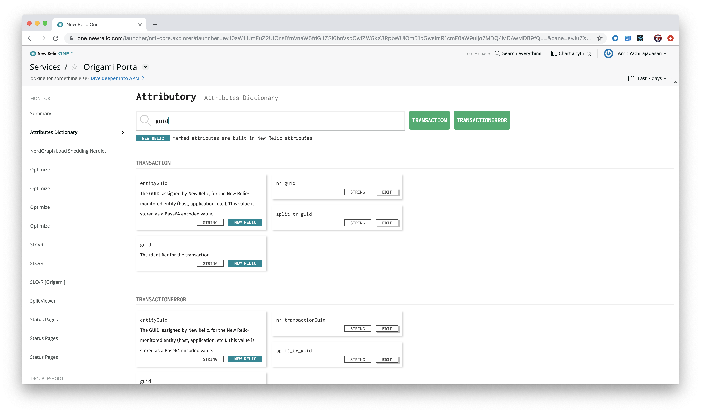
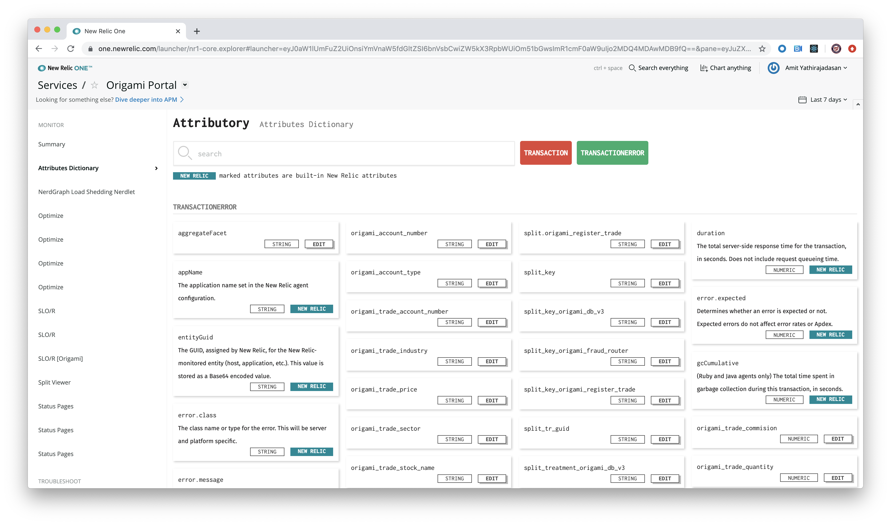
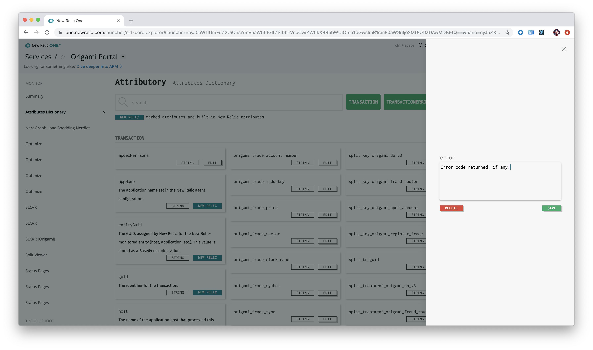

[](https://github.com/newrelic/open-source-office/blob/master/examples/categories/index.md#category-community-project) 

 [](https://snyk.io/test/github/newrelic/nr1-attributory)

# Attributory

Attributory is a dictionary for your APM, Browser, or Mobile application attributes stored within New Relic. Attributory is an entity level New Relic One application that's listed as Attributes Dictionary in the left-hand navigation when you open a service, Browser application, or Mobile application from the entity explorer.

## Usage


New Relic stores event data as key-value pairs known as attributes. Attributory displays a list of the attributes for your application. Built-in New Relic attributes include the definition of the attribute. For custom attributes, you can choose to add your own definitions.

## Open source license

This project is distributed under the [Apache 2 license](LICENSE).

## What do you need to make this work?

Applications with New Relic APM, Browser, or Mobile agents reporting into New Relic.

## Getting started

1. Ensure that you have [Git](https://git-scm.com/book/en/v2/Getting-Started-Installing-Git) and [NPM](https://www.npmjs.com/get-npm) installed. If you're unsure whether you have one or both of them installed, run the following command. (If you have them installed these commands will return a version number; if not, the commands won't be recognized.)
```bash
git --version
npm -v
```
2. Install the [New Relic One CLI](https://one.newrelic.com/launcher/developer-center.launcher) by going to [this link](https://one.newrelic.com/launcher/developer-center.launcher) and following the instructions (5 minutes or less) to install and set up your New Relic development environment.
3. Run the following command to clone this repository and run the code locally against your New Relic data:

```bash
nr1 nerdpack:clone -r https://github.com/newrelic/nr1-attributory.git
cd nr1-attributory
nr1 nerdpack:serve
```

Visit [https://one.newrelic.com/?nerdpacks=local](https://one.newrelic.com/?nerdpacks=local); navigate to APM (listed as Services within New Relic One), Browser or Mobile. Click on the **Attributes Dictionary** option within the left-navigation column, and :sparkles:

## Deploying this Nerdpack

Open a command prompt in the nerdpack's directory and run the following commands.

```bash
# If you need to create a new uuid for the account to which you're deploying this Nerdpack, use the following
# nr1 nerdpack:uuid -g [--profile=your_profile_name]
# to see a list of APIkeys / profiles available in your development environment, run nr1 credentials:list
nr1 nerdpack:publish [--profile=your_profile_name]
nr1 nerdpack:deploy [-c [DEV|BETA|STABLE]] [--profile=your_profile_name]
nr1 nerdpack:subscribe [-c [DEV|BETA|STABLE]] [--profile=your_profile_name]
```

Visit [https://one.newrelic.com](https://one.newrelic.com); navigate to APM (listed as Services within New Relic One), Browser or Mobile. Click on the **Attributes Dictionary** option within the left-navigation column, and :sparkles:

## Using Attributory

Attributory displays all attributes for your application stored within New Relic events. Use the search textbox to quickly find a specific attribute or attributes.



If you want Attributory to only display attributes within a specific event, click on the event name listed to the right of the search textbox. This toggles the display of attributes within that event.



For custom attributes, you can add your own definition by clicking on the **EDIT** button for a specific attribute.



# Support

New Relic has open-sourced this project. This project is provided **AS-IS WITHOUT WARRANTY OR DEDICATED SUPPORT**. Issues and contributions should be reported to the project here on GitHub.

We encourage you to bring your experiences and questions to the [Explorers Hub](https://discuss.newrelic.com) where our community members collaborate on solutions and new ideas.

## Community

New Relic hosts and moderates an online forum where customers can interact with New Relic employees as well as other customers to get help and share best practices. Like all official New Relic open source projects, there's a related community topic in the New Relic Explorers Hub. You can find this project's topic/threads here:

https://discuss.newrelic.com/t/nr1-attributory-nerdpack/94339

## Issues and enhancement requests

Submit issues and enhancement requests in the [Issues tab of this repository](../../issues). Please search for and review the existing open issues before submitting a new issue.

# Contributing

Contributions are welcome (and if you submit an enhancement request, expect to be invited to contribute it yourself :grin:). Please review our [contributors guide](CONTRIBUTING.md).

Keep in mind that when you submit your pull request, you'll need to sign the CLA via the click-through using CLA-Assistant. If you'd like to execute our corporate CLA, or if you have any questions, please drop us an email at opensource+nr1-attributory@newrelic.com.
